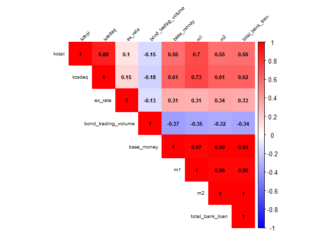
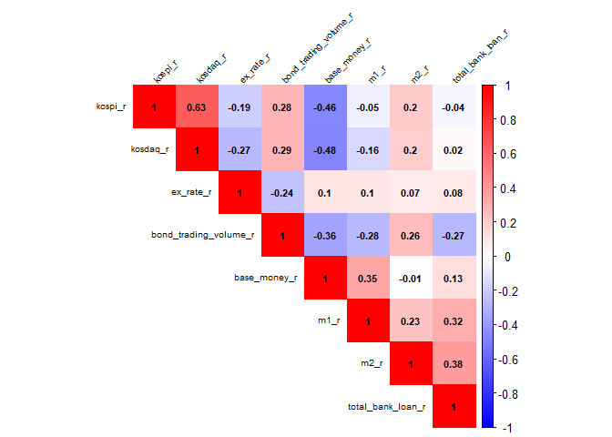

주식 거래량과 거시데이터
================

## 데이터 소개

kospi: 코스피 거래대금 kosdaq: 코스피 거래대금 ex\_rate: 원/달러 환율(월평균)
bond\_trading\_volume: 채권 거래대금 base\_money: 본원통화(평잔) m1: m1 통화량(평잔) m2:
m2 통화량(평잔) total\_bank\_loan: 예금은행 대출금(평잔)

``` r
# 데이터 불러오기
data = read.csv('data_r.csv', header = T, stringsAsFactors = F)

# 패키지 로딩
pkg = c( 'stringr', 'dplyr', 'ggplot2', 'plotly', 'magrittr', 'corrplot', 'tidyr')

new.pkg = pkg[!(pkg %in% installed.packages()[, "Package"])]

if (length(new.pkg)) 
  install.packages(new.pkg, dependencies = TRUE)
  sapply(pkg, require, character.only = TRUE)
```

    ##  stringr    dplyr  ggplot2   plotly magrittr corrplot    tidyr 
    ##     TRUE     TRUE     TRUE     TRUE     TRUE     TRUE     TRUE

``` r
# 상관관계 도표(수준 변수에 대하여)
cor(data[, 2:9]) %>% corrplot(method = 'color', type = 'upper',
                             addCoef.col = 'black', number.cex = 0.7,
                             tl.cex = 0.6, tl.srt = 45, tl.col = 'black',
                             col = colorRampPalette(c('blue', 'white', 'red'))(200),
                             mar = c(0, 0, 0.5, 0))
```

<!-- -->

``` r
# 상관관계 도표(변화율 변수에 대하여)
cor(data[-1, 10:17]) %>% corrplot(method = 'color', type = 'upper',
                              addCoef.col = 'black', number.cex = 0.7,
                              tl.cex = 0.6, tl.srt = 45, tl.col = 'black',
                              col = colorRampPalette(c('blue', 'white', 'red'))(200),
                              mar = c(0, 0, 0.5, 0))
```

<!-- -->

``` r
# 상관관계가 유의한지 test

# 코스피 거래량과 환율
cor.test(data[, 2], data[, 4])
```

    ## 
    ##  Pearson's product-moment correlation
    ## 
    ## data:  data[, 2] and data[, 4]
    ## t = 0.74955, df = 52, p-value = 0.4569
    ## alternative hypothesis: true correlation is not equal to 0
    ## 95 percent confidence interval:
    ##  -0.1690530  0.3611503
    ## sample estimates:
    ##       cor 
    ## 0.1033875

``` r
# 코스피 거래량과 채권 거래량
cor.test(data[, 2], data[, 5])
```

    ## 
    ##  Pearson's product-moment correlation
    ## 
    ## data:  data[, 2] and data[, 5]
    ## t = -1.0651, df = 52, p-value = 0.2917
    ## alternative hypothesis: true correlation is not equal to 0
    ## 95 percent confidence interval:
    ##  -0.3982973  0.1265934
    ## sample estimates:
    ##        cor 
    ## -0.1461202

``` r
# 코스피 거래량과 본원통화량
cor.test(data[, 2], data[, 6])
```

    ## 
    ##  Pearson's product-moment correlation
    ## 
    ## data:  data[, 2] and data[, 6]
    ## t = 4.9189, df = 52, p-value = 9.142e-06
    ## alternative hypothesis: true correlation is not equal to 0
    ## 95 percent confidence interval:
    ##  0.3483027 0.7222872
    ## sample estimates:
    ##       cor 
    ## 0.5635094

``` r
# 코스피 거래량과 M1
cor.test(data[, 2], data[, 7])
```

    ## 
    ##  Pearson's product-moment correlation
    ## 
    ## data:  data[, 2] and data[, 7]
    ## t = 7.0949, df = 52, p-value = 3.492e-09
    ## alternative hypothesis: true correlation is not equal to 0
    ## 95 percent confidence interval:
    ##  0.5338304 0.8158860
    ## sample estimates:
    ##       cor 
    ## 0.7013421

``` r
# 코스피 거래량과 M2
cor.test(data[, 2], data[, 8])
```

    ## 
    ##  Pearson's product-moment correlation
    ## 
    ## data:  data[, 2] and data[, 8]
    ## t = 4.7838, df = 52, p-value = 1.46e-05
    ## alternative hypothesis: true correlation is not equal to 0
    ## 95 percent confidence interval:
    ##  0.3345720 0.7147692
    ## sample estimates:
    ##       cor 
    ## 0.5528091

``` r
# 코스피 거래량과 대출잔액
cor.test(data[, 2], data[, 9])
```

    ## 
    ##  Pearson's product-moment correlation
    ## 
    ## data:  data[, 2] and data[, 9]
    ## t = 4.8812, df = 52, p-value = 1.042e-05
    ## alternative hypothesis: true correlation is not equal to 0
    ## 95 percent confidence interval:
    ##  0.3445025 0.7202153
    ## sample estimates:
    ##       cor 
    ## 0.5605551

``` r
# 코스피 거래량 월별 변화율과 환율 변화율
cor.test(data[, 10], data[, 12])
```

    ## 
    ##  Pearson's product-moment correlation
    ## 
    ## data:  data[, 10] and data[, 12]
    ## t = -1.3685, df = 51, p-value = 0.1772
    ## alternative hypothesis: true correlation is not equal to 0
    ## 95 percent confidence interval:
    ##  -0.43629861  0.08649485
    ## sample estimates:
    ##        cor 
    ## -0.1881989

``` r
# 코스피 거래량 월별 변화율과 채권거래량 변화율
cor.test(data[, 10], data[, 13])
```

    ## 
    ##  Pearson's product-moment correlation
    ## 
    ## data:  data[, 10] and data[, 13]
    ## t = 2.0886, df = 51, p-value = 0.04175
    ## alternative hypothesis: true correlation is not equal to 0
    ## 95 percent confidence interval:
    ##  0.01127059 0.51214462
    ## sample estimates:
    ##       cor 
    ## 0.2807093
